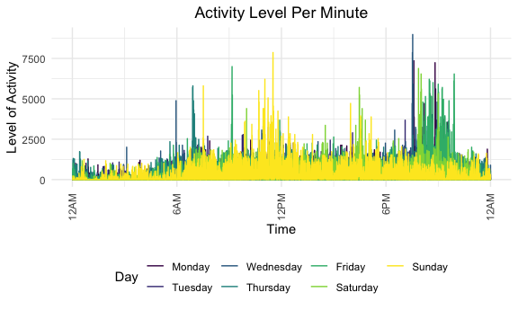

Homework 3
================
JR Chansakul
2020-10-05

## Problem 1

``` r
data("instacart")
```

This dataset contains 1384617 rows and 15columns.

Observations are the level of items in orders by user. There are user /
order variables – user ID, order ID, order day, and order hour. There
are also item variables – name, aisle, department, and some numeric
codes.

How many aisles, and which are most items from?

``` r
instacart %>% 
    count(aisle) %>% 
  arrange(desc(n))
```

    ## # A tibble: 134 x 2
    ##    aisle                              n
    ##    <chr>                          <int>
    ##  1 fresh vegetables              150609
    ##  2 fresh fruits                  150473
    ##  3 packaged vegetables fruits     78493
    ##  4 yogurt                         55240
    ##  5 packaged cheese                41699
    ##  6 water seltzer sparkling water  36617
    ##  7 milk                           32644
    ##  8 chips pretzels                 31269
    ##  9 soy lactosefree                26240
    ## 10 bread                          23635
    ## # … with 124 more rows

Let’s make a plot.

``` r
instacart %>% 
    count(aisle) %>% 
    filter(n > 10000) %>% 
  mutate(
        aisle = factor(aisle),
        aisle = fct_reorder(aisle, n)
    ) %>% 
    ggplot(aes(x = aisle, y = n)) + 
    geom_point() +
    theme(axis.text.x = element_text(angle = 90, vjust = 0.5, hjust = 1))
```


Let’s make a table\!

``` r
instacart %>% 
    filter(aisle %in% c("baking ingredients", "dog food care", "packaged vegetables fruits")) %>%
  group_by(aisle) %>% 
    count(product_name) %>% 
    mutate(rank = min_rank(desc(n))) %>% 
  filter(rank < 4) %>% 
  arrange(aisle, rank) %>% 
    knitr::kable()
```

| aisle                      | product\_name                                 |    n | rank |
| :------------------------- | :-------------------------------------------- | ---: | ---: |
| baking ingredients         | Light Brown Sugar                             |  499 |    1 |
| baking ingredients         | Pure Baking Soda                              |  387 |    2 |
| baking ingredients         | Cane Sugar                                    |  336 |    3 |
| dog food care              | Snack Sticks Chicken & Rice Recipe Dog Treats |   30 |    1 |
| dog food care              | Organix Chicken & Brown Rice Recipe           |   28 |    2 |
| dog food care              | Small Dog Biscuits                            |   26 |    3 |
| packaged vegetables fruits | Organic Baby Spinach                          | 9784 |    1 |
| packaged vegetables fruits | Organic Raspberries                           | 5546 |    2 |
| packaged vegetables fruits | Organic Blueberries                           | 4966 |    3 |

Apples vs ice cream..

``` r
instacart %>% 
    filter(product_name %in% c("Pink Lady Apples", "Coffee Ice Cream")) %>%
  group_by(product_name, order_dow) %>% 
    summarize(mean_hour = mean(order_hour_of_day)) %>% 
    pivot_wider(
        names_from = order_dow,
        values_from = mean_hour
    )
```

    ## `summarise()` regrouping output by 'product_name' (override with `.groups` argument)

    ## # A tibble: 2 x 8
    ## # Groups:   product_name [2]
    ##   product_name       `0`   `1`   `2`   `3`   `4`   `5`   `6`
    ##   <chr>            <dbl> <dbl> <dbl> <dbl> <dbl> <dbl> <dbl>
    ## 1 Coffee Ice Cream  13.8  14.3  15.4  15.3  15.2  12.3  13.8
    ## 2 Pink Lady Apples  13.4  11.4  11.7  14.2  11.6  12.8  11.9

## Problem 2

## Problem 2 part 1

Load, tidy, and otherwise wrangle the data. Your final dataset should
include all originally observed variables and values; have useful
variable names; include a weekday vs weekend variable; and encode data
with reasonable variable classes. Describe the resulting dataset
(e.g. what variables exist, how many observations, etc).

``` r
##Tidy and Wrangle Dataset
tidy_accel_df=
  read.csv("./data/accel_data.csv") %>%
  janitor::clean_names() %>%
  pivot_longer(
          activity_1:activity_1440,
          names_to = "activity_minute", 
          names_prefix = "activity_",
          values_to = "activity_count") %>% 
  mutate(
    Weekdays = 
      case_when(day %in% c("Saturday", "Sunday") ~ "weekend",
                day %in% c("Monday", "Tuesday", "Wednesday", "Thursday", "Friday") ~  "weekday")) %>%
  mutate(
      activity_minute = as.numeric(activity_minute),
      day = factor(day),
      day = fct_relevel(day, c("Monday", "Tuesday", "Wednesday", "Thursday", "Friday", "Saturday", "Sunday"))) %>%
  view ()

# View variable types of final dataset

view(tidy_accel_df) %>% view ()
sapply(tidy_accel_df, class) %>% view ()
```

The accelerometer dataset contains daily information of “activity
counts” in one-minute intervals of a 63 year-old male with BMI 25, who
was admitted to Columbia University Medical Center and diagnosed with
congestive heart failure (CHF). The tidied dataset contains 6 variables
and 50400 rows or observations.The variables included in the dataset are
week, day\_id, day, activity\_minute, activity\_count, Weekdays and
their variable types are integer, integer, factor, numeric, numeric,
character, respectively.

We have 35 days of activity count data collected from the 65 year-old
male by minute. We have the `week` variable that denotes the week that
that accelerometer data was collected and the newly generated factor
variable of `weekdays`, which denotes whether the data collected was on
a weekend or a weekday.

## Problem 2 part 2

Traditional analyses of accelerometer data focus on the total activity
over the day. Using your tidied dataset, aggregate accross minutes to
create a total activity variable for each day, and create a table
showing these totals. Are any trends apparent?

``` r
Total_activity_day = 
  tidy_accel_df %>% 
    group_by(week, day) %>%
  mutate(
    sum_activity_day = sum(activity_count),
    sum_activity_day = as.numeric(sum_activity_day)) %>% 
  select(week, day, sum_activity_day) %>% 
  distinct() %>%
  arrange (week, day) %>%
  relocate (week, day) %>%
  view ()

# View in table format 
Total_activity_day %>% 
knitr::kable()
```

| week | day       | sum\_activity\_day |
| ---: | :-------- | -----------------: |
|    1 | Monday    |           78828.07 |
|    1 | Tuesday   |          307094.24 |
|    1 | Wednesday |          340115.01 |
|    1 | Thursday  |          355923.64 |
|    1 | Friday    |          480542.62 |
|    1 | Saturday  |          376254.00 |
|    1 | Sunday    |          631105.00 |
|    2 | Monday    |          295431.00 |
|    2 | Tuesday   |          423245.00 |
|    2 | Wednesday |          440962.00 |
|    2 | Thursday  |          474048.00 |
|    2 | Friday    |          568839.00 |
|    2 | Saturday  |          607175.00 |
|    2 | Sunday    |          422018.00 |
|    3 | Monday    |          685910.00 |
|    3 | Tuesday   |          381507.00 |
|    3 | Wednesday |          468869.00 |
|    3 | Thursday  |          371230.00 |
|    3 | Friday    |          467420.00 |
|    3 | Saturday  |          382928.00 |
|    3 | Sunday    |          467052.00 |
|    4 | Monday    |          409450.00 |
|    4 | Tuesday   |          319568.00 |
|    4 | Wednesday |          434460.00 |
|    4 | Thursday  |          340291.00 |
|    4 | Friday    |          154049.00 |
|    4 | Saturday  |            1440.00 |
|    4 | Sunday    |          260617.00 |
|    5 | Monday    |          389080.00 |
|    5 | Tuesday   |          367824.00 |
|    5 | Wednesday |          445366.00 |
|    5 | Thursday  |          549658.00 |
|    5 | Friday    |          620860.00 |
|    5 | Saturday  |            1440.00 |
|    5 | Sunday    |          138421.00 |

``` r
# View variable types in dataset 
sapply(Total_activity_day, class) %>% view ()
```

The 63 year old male has a mean activity count per day of
3.845434510^{5} with a standard deviation of 1.634817310^{5} that ranges
from 1440 to 6.859110^{5}. His activity count seems to increase the
first two weeks and then decline for the next two weeks. On week 5, the
activity count seems to increase again. However, the two Saturdays on
weeks 4 and 5 were his lowest activity count days at 1440.

## Problem 2 part 3

Accelerometer data allows the inspection activity over the course of the
day. Make a single-panel plot that shows the 24-hour activity time
courses for each day and use color to indicate day of the week. Describe
in words any patterns or conclusions you can make based on this graph.

``` r
tidy_accel_df %>% 
  ggplot(aes(x = activity_minute, y = activity_count, color = day)) + 
  geom_line() + 
  labs(
        title = "Activity Level Per Minute",
        x = "Time",
        y = "Level of Activity") +
  scale_x_continuous(
    breaks = c(0, 360, 720, 1080, 1440), 
    labels = c("12AM","6AM","12PM", "6PM","12AM"),
    limits = c(0, 1440)) +
    viridis::scale_color_viridis(
      name = "Day",
      discrete = TRUE)+ 
  theme_set(theme_minimal() + theme(legend.position = "bottom")) +   
  theme(axis.text.x = element_text(angle=90, vjust=0.5, hjust=1)) 
```



``` r
ggsave("./plots/accel_plot.pdf", height = 4, width = 6) 
```

We can conclude from this busy graphic that our patient had increased
activity between 6:00pm and 10:00pm on Monday, Wednesday, Friday and
Saturday suggesting he may go on exercise on socializing with friends on
these evenings. The patient seems to have morning activites between
6:00am and 9:00am from Wednesday, Thursday and Saturday. Additionally,
the lowest acitvity times are between 11:00pm and 6:00am suggesting that
the patient gets roughly 6-7 hours of sleep or downtime a week.

## Problem 3

## Problem 3 Part A

Write a short description of the dataset, noting the size and structure
of the data, describing some key variables, and indicating the extent to
which missing data is an issue.

``` r
# Import
data("ny_noaa")

# Looking at distinct weather station IDs and number of observations
ny_noaa %>% 
  group_by(id) %>% 
  summarize (n())
```

    ## `summarise()` ungrouping output (override with `.groups` argument)

    ## # A tibble: 747 x 2
    ##    id          `n()`
    ##    <chr>       <int>
    ##  1 US1NYAB0001  1157
    ##  2 US1NYAB0006   852
    ##  3 US1NYAB0010   822
    ##  4 US1NYAB0016   214
    ##  5 US1NYAB0017   459
    ##  6 US1NYAB0021   365
    ##  7 US1NYAB0022   273
    ##  8 US1NYAB0023   365
    ##  9 US1NYAB0025   215
    ## 10 US1NYAL0002   549
    ## # … with 737 more rows

``` r
# Date Range 
date_summary = ny_noaa %>% 
  group_by(date) %>% 
  summarize(n())  
```

    ## `summarise()` ungrouping output (override with `.groups` argument)

``` r
head(date_summary, 5)
```

    ## # A tibble: 5 x 2
    ##   date       `n()`
    ##   <date>     <int>
    ## 1 1981-01-01   236
    ## 2 1981-01-02   236
    ## 3 1981-01-03   236
    ## 4 1981-01-04   236
    ## 5 1981-01-05   236

``` r
tail(date_summary, 5)
```

    ## # A tibble: 5 x 2
    ##   date       `n()`
    ##   <date>     <int>
    ## 1 2010-12-27   455
    ## 2 2010-12-28   455
    ## 3 2010-12-29   455
    ## 4 2010-12-30   455
    ## 5 2010-12-31   455

``` r
# Percentage of NA's by column
colMeans(is.na(ny_noaa))  
```

    ##        id      date      prcp      snow      snwd      tmax      tmin 
    ## 0.0000000 0.0000000 0.0561958 0.1468960 0.2280331 0.4371025 0.4371264

``` r
# Varialbe Types in dataset
sapply(ny_noaa, class) %>% view ()
```

The original NOAA National Climatic Data Center dataset has 7 variables
and 2595176 observations/rows. The variables included in the dataset are
id, date, prcp, snow, snwd, tmax, tmin and their variable type is
character, Date, integer, integer, integer, character, character,
respectively.

Below is a brief description of the original variables:

id: Weather station ID date: Date of observation prcp: Precipitation
(tenths of mm) snow: Snowfall (mm) snwd: Snow depth (mm) tmax: Maximum
temperature (tenths of degrees C) tmin: Minimum temperature (tenths of
degrees C)

There are 747 unique weather stations that may provide information on
precipitation, snowfall, snow depth, min and max temperature on any
given day from 1981-01-01 to 2010-21-31. Unfortunately, we have a lot of
missing data. In particular, we found that the `tmin` and `tmax` columns
have 43.71% of its observations as NA and 22.80% of the observations for
the `snwd` variable as NA.

## Problem 3 Part B

Create separate variables for year, month, and day. Ensure observations
for temperature, precipitation, and snowfall are given in reasonable
units. For snowfall, what are the most commonly observed values? Why?

``` r
#Clean Dataset and Units
noaa_data = ny_noaa %>% 
  janitor::clean_names() %>% 
    separate(date, into = c("year", "month", "day"), sep = "-") %>% 
  mutate(
    prcp = prcp/10,
    snow = as.numeric(snow),
    snwd = as.numeric(snwd),
    tmax = as.numeric(tmax)/10,
    tmin = as.numeric(tmin)/10)

# Commonly observed Snowfall values
noaa_data %>% 
  count(snow) %>% 
  arrange(desc(n))
```

    ## # A tibble: 282 x 2
    ##     snow       n
    ##    <dbl>   <int>
    ##  1     0 2008508
    ##  2    NA  381221
    ##  3    25   31022
    ##  4    13   23095
    ##  5    51   18274
    ##  6    76   10173
    ##  7     8    9962
    ##  8     5    9748
    ##  9    38    9197
    ## 10     3    8790
    ## # … with 272 more rows

I separated date into year, month and day as well as converted
precipitation to mm, tmax to C, and tmin to C by dividing by 10. I found
that the most commonly observed snowfall value is 0. This is most likely
due to snow only occurring in the winter and some years may not have
snow.

## Problem 3 Part C

Make a two-panel plot showing the average max temperature in January and
in July in each station across years. Is there any observable /
interpretable structure? Any outliers?

``` r
# View part of Dataset
noaa_data %>% slice (1:1000) %>%
  view

# Two-panel Plot
noaa_data %>% 
  filter(month %in% c("01","07")) %>% 
  group_by(id, month, year) %>% 
  summarize(avg_tmax = mean(tmax, na.rm = TRUE)) %>% 
  mutate(
    month = as.numeric(month),
    month = month.abb[month]) %>% 
  select(id, year, month, avg_tmax) %>%
  ggplot(aes(x = year, y = avg_tmax, color = month)) + 
  geom_point(alpha = 0.6) +
  geom_line(alpha = 0.5) +
  geom_smooth(alpha = 0.3)+
  labs(
        title = "Avg. Max Temp. of each station across years",
        x = "Year",
        y = "Average Max Temperature (C)") +          
  scale_color_manual(values=c("blue", "red")) +
  theme(axis.text.x = element_text(angle=90, vjust=0.5, hjust=1),
        legend.position = "right") +
  scale_x_discrete(breaks = seq(1981, 2010, 3))
```

    ## `summarise()` regrouping output by 'id', 'month' (override with `.groups` argument)

    ## `geom_smooth()` using method = 'loess' and formula 'y ~ x'

    ## Warning: Removed 5970 rows containing non-finite values (stat_smooth).

    ## Warning: Removed 5970 rows containing missing values (geom_point).

    ## Warning: Removed 1492 row(s) containing missing values (geom_path).


Overall, the average maximum temperature in July is warmer than the
average maximum temperature in January across the 30 years. In January,
the average maximum temperature fluctuates between -10 to 10 degrees
Celsius, while the average maximum temperature in July fluctuates
between +20 and +30 degress Celsius.

We observat that the recorded temperatures from the different stations
can vary as seen with the outliers. For example, one station in July,
1988 recorded a much lower temperature than other stations.
Additionally, we see outliers in January 1982, 2004, and 2005. One
explanation for some of these outliers might be the location of the
station as the temperature may vary significantly depending on where the
station records its data.

## Problem 3 Part D

Make a two-panel plot showing (i) tmax vs tmin for the full dataset
(note that a scatterplot may not be the best option); and (ii) make a
plot showing the distribution of snowfall values greater than 0 and less
than 100 separately by year.

x minutes on x-axissand activity count on y-axis only 1 plot data
manipulation steps and then plotting
